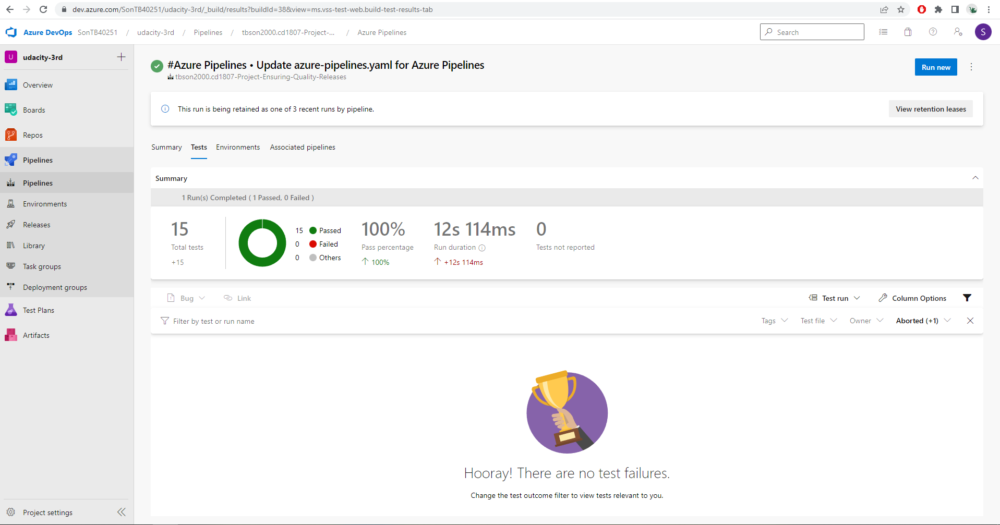
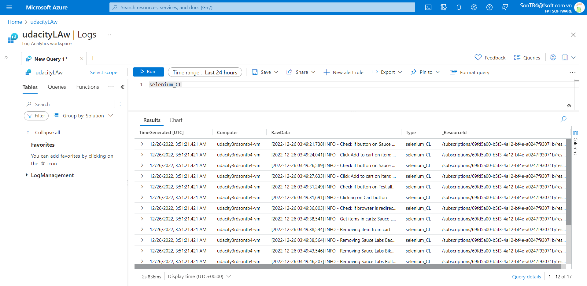

# Project Starter
This repository contains the starter code for the **Ensuring Quality Releases** project of the cd1807 Ensuring Quality Releases (Quality Assurance) course taught by Nathan Anderson. 

## Azure Pipeline
## Pre-requisition

To operate on this repo, following actions are required:

* Have an Azure Account
* Install `az cli`
* Login to your Azure account using CLI:

```sh
az login
```

* Build packer images with this [template](/packer/)
* Create a storage account based on this [script](/terraform/environments/test/configure-tfstate-storage-account.sh)
* Add your Azure account to service connection in Azure DevOps project

## Pipeline

Azure pipeline include of 3 stages:

* Build: building infrastructure using Terraform and publish artifact for later stages
* Deploy: deploying Fake Rest API to Azure App Service using ZIP Deployment
* Test: running 3 test suites including: Postman/Newman, JMeter, Selenium

## Monitoring configuration

### App Service Alert

Following this [document](https://learn.microsoft.com/en-us/azure/azure-monitor/alerts/alerts-overview) to create alert for Azure App Services.

### Log Analytics for VM

Following this [document](https://learn.microsoft.com/en-us/azure/azure-monitor/agents/data-sources-custom-logs) to create Custom Logs for VM. Please be patient while waiting for logs to be ingested to Log Analytics

## Results
* output of Terraform when executed by the CI/CD pipeline


* the successful execution of the pipeline


* Test Run Results from Postman shown in Azure DevOps



* Successful execution of the Test Suite on a VM in Azure DevOps


* HTML report generated by JMeter. A screenshot of the log output of JMeter when executed by the CI/CD pipeline


* email received when the alert is triggered (for actual setting using HTTP404 error to trigger would be better - https://en.wikipedia.org/wiki/HTTP_404 - it would able the developer to check the new deployment


* alert rule


* resource, condition, action group, alert name, and severity


* resource’s metrics will correspond to the approximate time that the alert was triggered.


* log analytics queries (able to set up the Azure Log Analystic)



